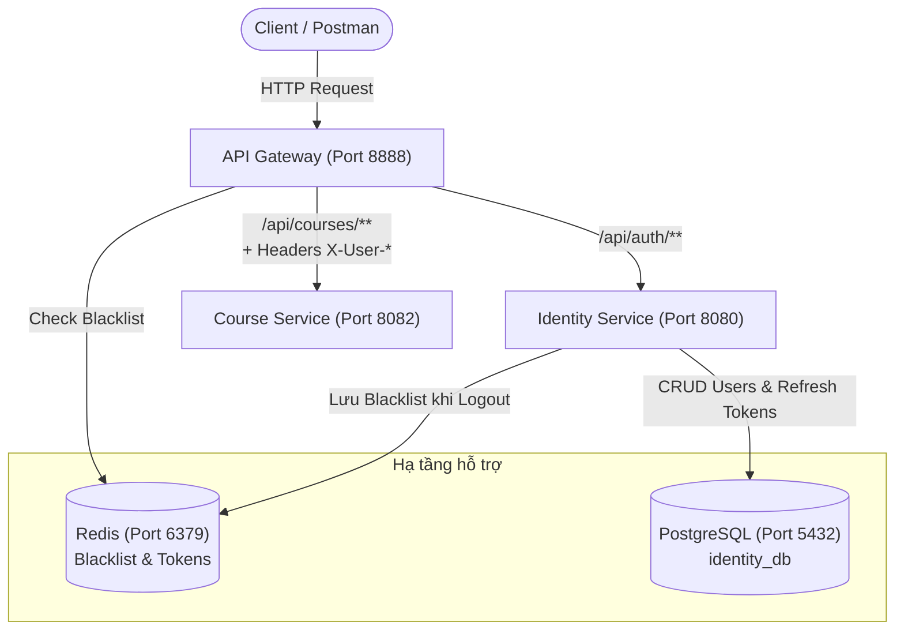

# Microservices Authentication & Course Management System

Hệ thống kiến trúc Microservices xây dựng trên nền tảng **Java 21**, **Spring Boot 3.5**, **Spring Security 6**, và **Spring Cloud Gateway**, kết hợp hai mô hình phân quyền: **RBAC** (Role-Based Access Control) và **PBAC** (Permission-Based Access Control) thuần túy.

---

## 📑 Mục lục
1. [Kiến trúc tổng quan](#-kiến-trúc-tổng-quan)
2. [Các dịch vụ thành phần](#-các-dịch-vụ-thành-phần)
3. [Mô hình bảo mật & phân quyền (RBAC & PBAC)](#-mô-hình-bảo-mật--phân-quyền)
4. [Tài khoản & Dữ liệu mẫu (Seed Data)](#-tài-khoản--dữ-liệu-mẫu)
5. [Hướng dẫn cài đặt & Khởi chạy](#-hướng-dẫn-cài-đặt--khởi-chạy)
6. [Tài liệu API & Kịch bản kiểm thử mẫu (cURL)](#-tài-liệu-api--kịch-bản-kiểm-thử-mẫu)
7. [Chạy kiểm thử tự động (Unit & Integration Tests)](#-chạy-kiểm-thử-tự-động)

---

## 🏛 Kiến trúc tổng quan

Hệ thống bao gồm 3 service độc lập, giao tiếp thông qua **API Gateway** làm điểm tiếp nhận duy nhất cho toàn bộ client:



### Luồng xử lý request qua API Gateway:
1. **Xác thực JWT tại Gateway (`JwtAuthFilter`):**
   - Kiểm tra `Authorization: Bearer <token>`.
   - Đối chiếu claim `jti` (JWT ID) với Redis Blacklist để từ chối các token đã đăng xuất.
   - Giải mã payload JWT, trích xuất: `username`, `role`, `permissions`.
2. **Làm giàu Header (Header Enrichment):**
   - Gateway gắn các headers an toàn vào downstream request:
     - `X-User-Id`: Username của người dùng.
     - `X-User-Role`: Vai trò chính (ví dụ: `STUDENT`, `INSTRUCTOR`).
     - `X-User-Permissions`: Mảng JSON chứa các quyền cụ thể (ví dụ: `["COURSE_READ", "COURSE_WRITE"]`).
3. **Phân quyền tại Course Service (`HeaderAuthenticationFilter`):**
   - Đọc danh tính và quyền từ downstream headers.
   - Thực thi PBAC thuần túy: Quyền hạn được nạp trực tiếp từ `X-User-Permissions` mà không tin cậy hay fallback vào Role.

---

## 📦 Các dịch vụ thành phần

| Dịch vụ | Cổng | Công nghệ | Trách nhiệm chính |
| :--- | :--- | :--- | :--- |
| **`api-gateway`** | `8888` | Spring Cloud Gateway (Reactive), Spring Data Redis | • Định tuyến request.<br>• Whitelist các public auth endpoints.<br>• Xác thực JWT và kiểm tra Redis Blacklist bằng `jti`.<br>• Trích xuất claims và gắn downstream headers (`X-User-Id`, `X-User-Role`, `X-User-Permissions`). |
| **`identity-service`** | `8080` | Spring WebMVC, Spring Security 6, Spring Data JPA, Redis, PostgreSQL | • Đăng ký tài khoản (`/api/auth/register`).<br>• Đăng nhập & phát hành JWT cặp Access Token / Refresh Token (`/api/auth/login`).<br>• Cấp lại token theo cơ chế Token Rotation (`/api/auth/refresh`).<br>• Đăng xuất và đưa token vào Redis Blacklist (`/api/auth/logout`).<br>• Tự động seed tài khoản & vai trò mẫu khi khởi động. |
| **`course-service`** | `8082` | Spring WebMVC, Spring Security 6 (Method Security) | • Quản lý danh sách khóa học in-memory thread-safe (`CopyOnWriteArrayList`).<br>• Không kết nối database trực tiếp.<br>• Phân quyền PBAC thuần qua `@PreAuthorize("hasAuthority(...)")`.<br>• Phân trang danh sách an toàn (`PageResponse<T>`).<br>• `GlobalExceptionHandler` xử lý chuẩn hóa mã lỗi RESTful kèm `correlationId`. |

---

## 🛡 Mô hình bảo mật & phân quyền

### 1. Phân quyền dựa trên quyền hạn (PBAC - Permission-Based Access Control)
Khác với RBAC truyền thống (kiểm tra `hasRole('INSTRUCTOR')`), hệ thống áp dụng **Pure PBAC** tại Resource Server (`course-service`):
- Endpoint được bảo vệ bằng quyền hạn cụ thể:
  - `GET /api/courses`: Yêu cầu quyền `COURSE_READ`.
  - `GET /api/courses/{id}`: Yêu cầu quyền `COURSE_READ`.
  - `POST /api/courses`: Yêu cầu quyền `COURSE_WRITE`.
- **Fail-Closed Principle:** Nếu `X-User-Permissions` bị thiếu, rỗng `[]`, hoặc JSON lỗi định dạng, user sẽ không nhận được bất kỳ quyền nào và bị từ chối với mã **`403 Forbidden`**.

### 2. Bảng ma trận Quyền & Vai trò

| Role | COURSE_READ | COURSE_WRITE | Ghi chú |
| :--- | :---: | :---: | :--- |
| **`STUDENT`** | ✅ | ❌ | Chỉ được phép xem danh sách và chi tiết khóa học. |
| **`INSTRUCTOR`** | ✅ | ✅ | Được phép xem và tạo mới khóa học. |
| **`ROLE_ADMIN`** | ✅ | ✅ | Quyền quản trị toàn diện. |
| **`ROLE_USER`** | ✅ | ❌ | Người dùng thông thường mặc định. |

---

## 👥 Tài khoản & Dữ liệu mẫu

Hệ thống được cấu hình `DataInitializer` trong `identity-service` để tự động khởi tạo dữ liệu mẫu khi ứng dụng khởi chạy:

| Username | Password | Role | Quyền hạn tương ứng |
| :--- | :--- | :--- | :--- |
| `student` | `password123` | `STUDENT` | `["COURSE_READ"]` |
| `instructor` | `password123` | `INSTRUCTOR` | `["COURSE_READ", "COURSE_WRITE"]` |
| `admin` | `password123` | `ROLE_ADMIN` | `["COURSE_READ", "COURSE_WRITE"]` |

---

## 🚀 Hướng dẫn cài đặt & Khởi chạy

### Yêu cầu môi trường
- **Java**: OpenJDK 21 trở lên.
- **Docker & Docker Compose**: Để chạy PostgreSQL và Redis.

### Bước 1: Khởi động PostgreSQL và Redis

Chạy PostgreSQL và Redis trên máy cục bộ hoặc dùng Docker:

```bash
# Khởi chạy PostgreSQL (Port 5432)
docker run -d --name identity-postgres \
  -e POSTGRES_DB=identity_db \
  -e POSTGRES_USER=rikkei \
  -e POSTGRES_PASSWORD=rikkei \
  -p 5432:5432 postgres:16-alpine

# Khởi chạy Redis (Port 6379)
docker run -d --name identity-redis \
  -p 6379:6379 redis:7-alpine redis-server --requirepass rikkeiacademy
```

### Bước 2: Khởi động các Microservices

Mở 3 terminal riêng biệt để khởi động từng service theo thứ tự:

#### 1. Khởi động `identity-service` (Port 8080)
```bash
cd identity-service
./gradlew bootRun
```

#### 2. Khởi động `course-service` (Port 8082)
```bash
cd course-service
./gradlew bootRun
```

#### 3. Khởi động `api-gateway` (Port 8888)
```bash
cd api-gateway
./gradlew bootRun
```

---

## 📡 Tài liệu API & Kịch bản kiểm thử mẫu

Toàn bộ request bên ngoài gửi tới **API Gateway** qua cổng **`8888`**.

### 1. Xác thực tài khoản (Authentication)

#### Đăng nhập với tài khoản Học viên (`student`)
```bash
curl -X POST http://localhost:8888/api/auth/login \
  -H "Content-Type: application/json" \
  -d '{
    "username": "student",
    "password": "password123"
  }'
```
*Phản hồi mẫu:*
```json
{
  "tokenType": "Bearer",
  "accessToken": "eyJhbGciOiJIUzI1NiJ9...",
  "refreshToken": "7c48b28f-7f70-4e3a-..."
}
```

#### Đăng nhập với tài khoản Giảng viên (`instructor`)
```bash
curl -X POST http://localhost:8888/api/auth/login \
  -H "Content-Type: application/json" \
  -d '{
    "username": "instructor",
    "password": "password123"
  }'
```

#### Cấp lại Access Token (Token Rotation)
```bash
curl -X POST http://localhost:8888/api/auth/refresh \
  -H "Content-Type: application/json" \
  -d '{
    "refreshToken": "<REFRESH_TOKEN_CỦA_BẠN>"
  }'
```

#### Đăng xuất (Thu hồi Token qua Redis Blacklist)
```bash
curl -X POST http://localhost:8888/api/auth/logout \
  -H "Authorization: Bearer <ACCESS_TOKEN_CỦA_BẠN>"
```

---

### 2. Quản lý Khóa học (Courses API - PBAC)

#### Lấy danh sách khóa học có phân trang (Yêu cầu quyền `COURSE_READ`)
*Áp dụng cho cả Student và Instructor:*
```bash
curl -X GET "http://localhost:8888/api/courses?page=0&size=10" \
  -H "Authorization: Bearer <STUDENT_OR_INSTRUCTOR_ACCESS_TOKEN>"
```
*Phản hồi mẫu (DTO `PageResponse<T>`):*
```json
{
  "content": [
    {
      "id": 1,
      "title": "Spring Boot Microservices Masterclass",
      "description": "Learn microservices architecture with Spring Boot 3 & Spring Cloud",
      "instructor": "Nguyen Van Instructor",
      "durationHours": 40,
      "createdAt": "2026-10-05T11:40:00"
    }
  ],
  "page": 0,
  "size": 10,
  "totalElements": 1,
  "totalPages": 1,
  "first": true,
  "last": true
}
```

#### Lấy chi tiết khóa học theo ID
```bash
curl -X GET "http://localhost:8888/api/courses/1" \
  -H "Authorization: Bearer <ACCESS_TOKEN>"
```

#### Tạo khóa học mới (Yêu cầu quyền `COURSE_WRITE`)
- **Với token của `instructor` (Thành công - `201 Created`):**
```bash
curl -X POST http://localhost:8888/api/courses \
  -H "Authorization: Bearer <INSTRUCTOR_ACCESS_TOKEN>" \
  -H "Content-Type: application/json" \
  -d '{
    "title": "Cloud Native with Kubernetes & Docker",
    "description": "Production grade deployment and scaling",
    "instructor": "Tran Van Instructor",
    "durationHours": 35
  }'
```

- **Với token của `student` (Bị chặn - `403 Forbidden`):**
```bash
curl -X POST http://localhost:8888/api/courses \
  -H "Authorization: Bearer <STUDENT_ACCESS_TOKEN>" \
  -H "Content-Type: application/json" \
  -d '{
    "title": "Hacker Course",
    "description": "Attempting unauthorized creation",
    "instructor": "Anonymous",
    "durationHours": 10
  }'
```
*Phản hồi lỗi mẫu (`403 Forbidden`):*
```json
{
  "status": 403,
  "error": "Forbidden",
  "message": "Access Denied: You do not have sufficient permissions to perform this action",
  "correlationId": "09ecaa26-4d0a-4286-9a57-19aaeb8b80fc",
  "timestamp": "2026-10-05T11:45:00"
}
```

---

## 🧪 Chạy kiểm thử tự động

Tất cả các dịch vụ đều được trang bị unit test và integration test toàn diện:

```bash
# Chạy test identity-service
(cd identity-service && ./gradlew cleanTest test)

# Chạy test api-gateway
(cd api-gateway && ./gradlew cleanTest test)

# Chạy test course-service
(cd course-service && ./gradlew cleanTest test)
```

---

## 🛡 Tính năng nâng cao & Chuẩn thiết kế
- **WebMVC Architecture:** Phân tách rành mạch Controller, Service, Repository, DTO, Config.
- **SOLID Principles:** SRP tách biệt `PermissionResolver`, OCP mở rộng dễ dàng role/permission mapping.
- **Distributed Tracing:** Sử dụng `correlationId` lưu trữ trong `MDC` và truyền tải qua HTTP headers xuyên suốt các dịch vụ.
- **Validation:** Bắt buộc `@Valid` cho các request body DTO, validate tham số phân trang `@Min` / `@Max`.
- **Fail-Safe & Fail-Closed:** Khi gateway gặp lỗi mạng hay token không hợp lệ, hệ thống từ chối truy cập an toàn.
